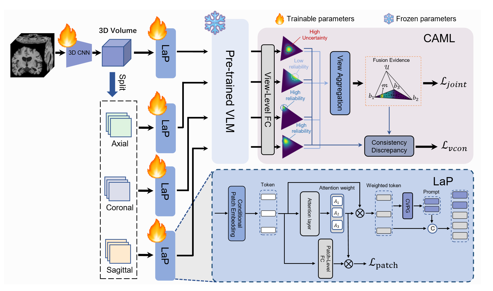

I am a second-year M.S. candidate in Computer Science at the [University of Electronic Science and Technology of China](https://www.uestc.edu.cn/) (UESTC), supervised by Professor [Xiaoshuang Shi](https://scholar.google.com/citations?user=BWGQt3YAAAAJ&hl=en). ​I hold a B.S. in Computer Science from [Harbin Engineering University](http://www.hrbeu.edu.cn/) (HEU), developing​ strong ​programming​ and ​analytical skills for complex engineering problem-solving. My research ​centers on Multimodal Learning​ and ​Medical Image Analysis.

# News
------
- *2022.02*: &nbsp;🎉🎉 Lorem ipsum dolor sit amet, consectetur adipiscing elit. Vivamus ornare aliquet ipsum, ac tempus justo dapibus sit amet. 
- *2022.02*: &nbsp;🎉🎉 Lorem ipsum dolor sit amet, consectetur adipiscing elit. Vivamus ornare aliquet ipsum, ac tempus justo dapibus sit amet. 

# Publications
------

  <!-- <video controls autoplay width="30%" style="margin-right: 30px;">
    <source src="../images/infnerf.mp4" type="video/mp4">
  </video> -->
  
    

        
<strong>Interpretable Multi-View Fusion Network for Alzheimer's Disease Diagnosis with Large-scale Pre-trained Vision-Language Model</strong>

        
<strong>Qiang Ma</strong>, Jinghao Xu, Tengfei Li, Xin Yuan, <a href="https://scholar.google.com/citations?user=-bk1CrcAAAAJ&hl=en">Xiaofeng Zhu</a>, <a href="https://scholar.google.com/citations?user=BWGQt3YAAAAJ&hl=en">Xiaoshuang Shi</a>

      
 Under Review 

<!--         
IEEE International Conference on Bioinformatics and Biomedicine (BIBM), 2025.
 -->
<!--         
[<a href="https://arxiv.org/pdf/2503.19307">Paper</a>] [<a href="https://github.com/alexmqth">Code</a>]
 -->
    

# Interships
------
- *2024.07 - 2025.07*, [Medical Dig Data Center, Sichuan University](https://www.wchscu.cn/dsj/index.html), China.

For more info
------
More info about configuring Academic Pages can be found
